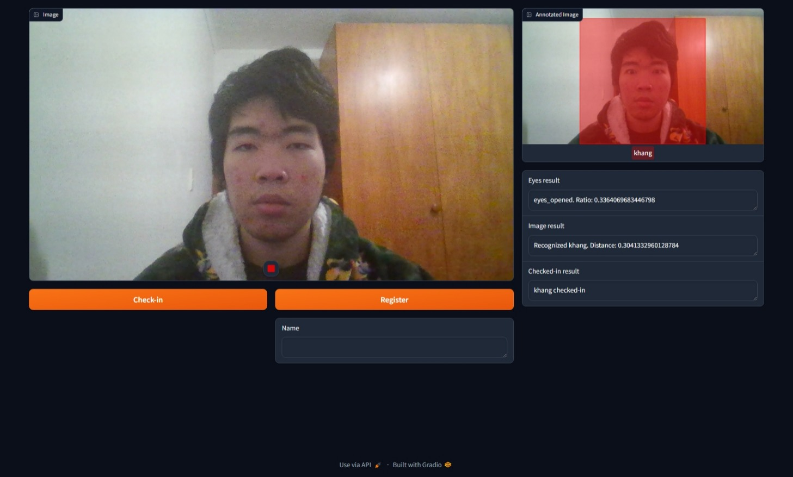

_Khang Vo_  
_COS30082 - Applied Machine Learning_  
_Swinburne University of Technology_
# Machine Learning Project - Face Recognition Attendance System with Liveness Detection

**Project Dependencies:**
* python 3.11.8
* tensorflow 2.16.1
* keras 3.1.1
* sklearn 1.2.2
* numpy 1.25.0
* matplotlib 3.8.4
* dlib 19.24.4
* gradio 4.32.1
* [shape_predictor_68_face_landmarks.dat](http://dlib.net/files/shape_predictor_68_face_landmarks.dat.bz2)

**Project Description:**
* The models was trained on the ["11-785-Fall-20-Homework-2: Part 2"](https://www.kaggle.com/c/11-785-fall-20-homework-2-part-2/overview/evaluation) dataset.
* The train.ipynb is used to build, train, and evaluate the models.
* Evaluated models are saved as .keras files
* The main.ipynb will run a Gradio application that use the evaluated model to recognize the face from webcam. User can go to the local link shown in the terminal to run the application.
* For more details, please refer to the Report.pdf

**Application Example:**
